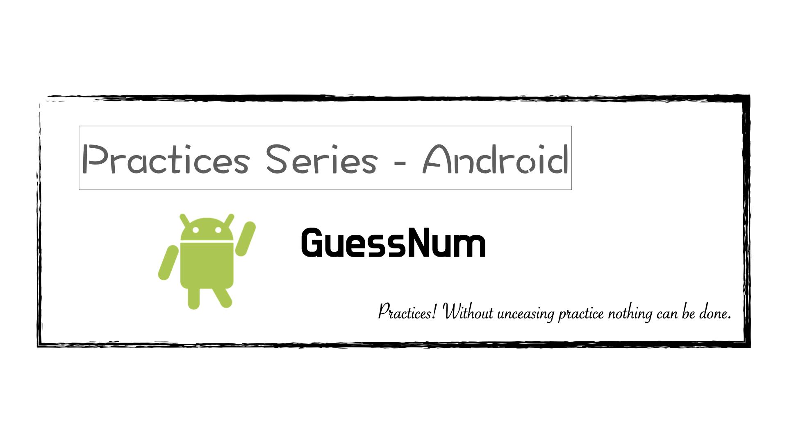
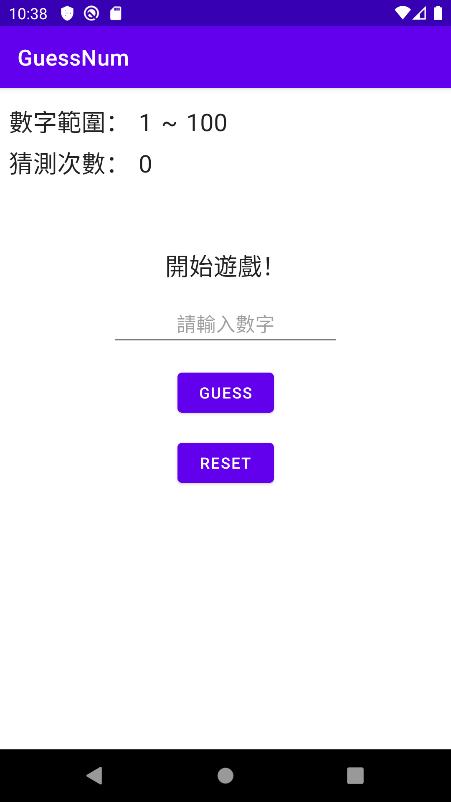
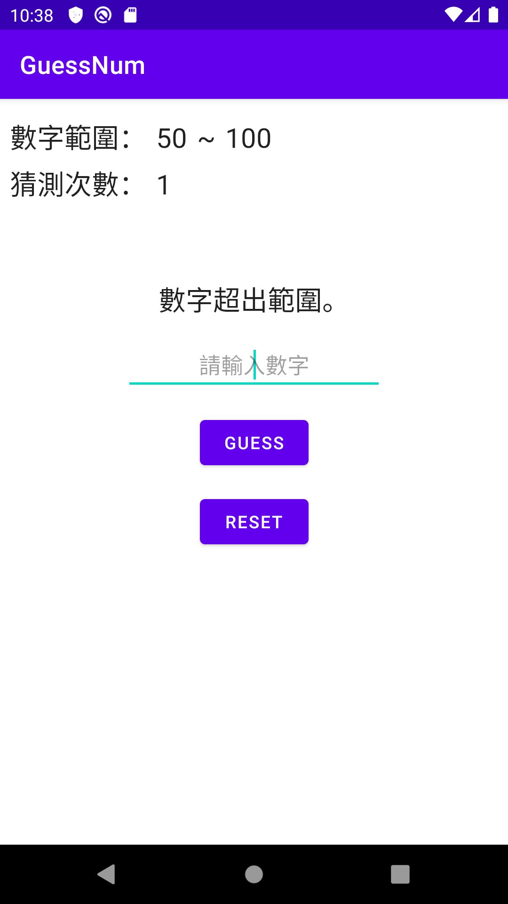
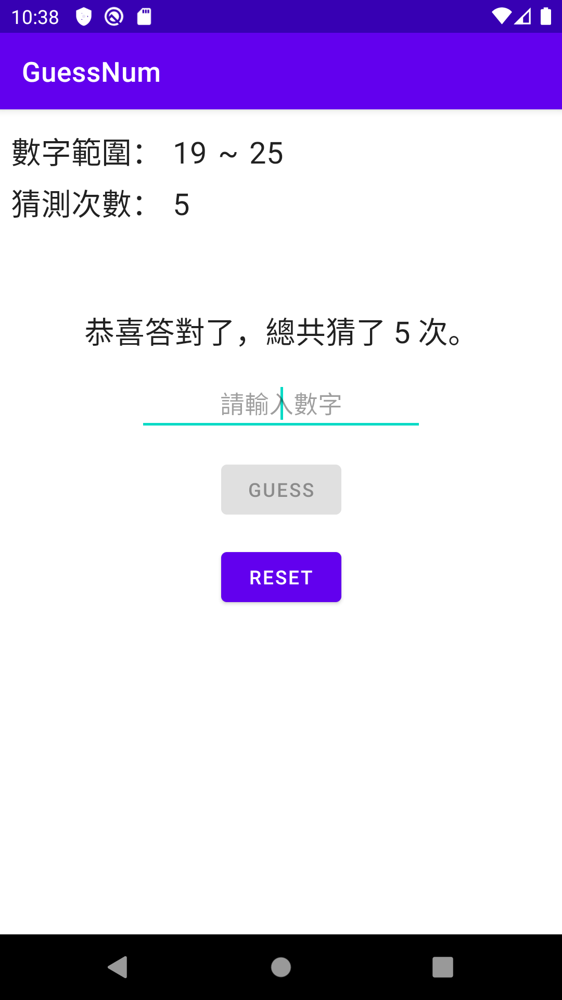

# GuessNum
實戰系列（Android）：GuessNum

---

---

### 說明 ###

本練習將以簡易版本的「猜數字遊戲」為範例；主要目標是將範例專案的架構從原本的「MVC」架構改為「MVVM」架構，並將「LiveCycle（LiveData、VideoModel）」、「DataBinding」⋯等「Android JetPack」的新元素導入使用。

---

### 預覽圖 ###

|       動態預覽圖       |     開始遊戲      |     輸入數值超出範圍     |         勝利          |
|:----------------------:|:-----------------:|:------------------------:|:---------------------:|
|  |  |  |  |

---

###### tags: `Android` `Java`
